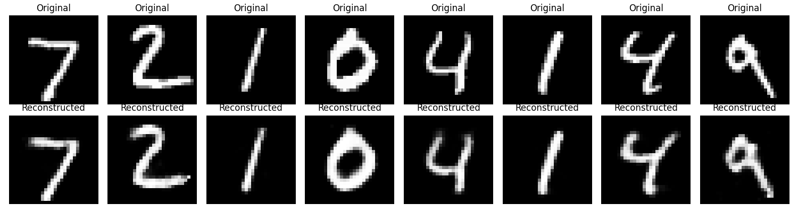

# Unsupervised Digit Clustering

This project explores different autoencoder architectures to learn meaningful compressed representations of handwritten digit images (MNIST dataset). These representations are used for clustering and generating new digit images.

## Components

- `models.py` – Definitions of various autoencoder models.
- `train_autoencoder.py` – Training loop for learning image compression and reconstruction.
- `visualize.py` – Visualizes reconstructed images after encoding and decoding.
- `clustering.py` – Applies clustering on compressed features and generates new images from clusters using decoder.

## Getting started

First install the requirements
```bash
pip install -r requirements.txt
```
Now you can train a model in `train_autoencoder.py`, just create an instance of model class, get data ready and call the train function related to your model, e.g:
```python
model = SemiSupervisedAutoEncoderMNIST()
train_dl, _ = get_data_loader(B)
train_semisupervised(model, LR, EPOCHS, ALPHA, BETA, train_dl)
t.save(model.state_dict(), "models/my_model.pth")
```
Then you can evaluate your model in `visualize.py`, just change the class name and the path to your own.

## Results

I have already trained a few models, some of them for clustering and some for generating.

### Basic AutoEncoder
Uses two fully-connected neuralnets (each consisting of two layers) to encode images into a 32-dim vector and reconstruct them.
```
Epoch 1 | loss: 34.667411958798766
Epoch 2 | loss: 18.782696314156055
Epoch 3 | loss: 16.7600677004084
Epoch 4 | loss: 16.00043888296932
Epoch 5 | loss: 15.500467980280519
Epoch 6 | loss: 15.166434440761805
Epoch 7 | loss: 14.916194557677954
```


embedding vectors are used for clustering, here you can see the results:
.png)

.png)


### Semi-Supervised AutoEncoder
Uses two fully-connected neuralnets (each consisting of two layers) to encode images into a 32-dim vector and reconstruct them, but there is also another two-layer fully connected neuralnet, that uses embedding vectors for classification, encouraging the encoder to learn meaningful representations.
```
Epoch 1 | loss: 417.76786778122187
Epoch 2 | loss: 246.84492147900164
Epoch 3 | loss: 223.53472829796374
Epoch 4 | loss: 197.3539989478886
Epoch 5 | loss: 179.37759531661868
Epoch 6 | loss: 169.41935079917312
Epoch 7 | loss: 165.76125618442893
Epoch 8 | loss: 151.1923408433795
Epoch 9 | loss: 142.3155386094004
Epoch 10 | loss: 141.77617640793324
```


embedding vectors are used for clustering, here you can see the results:
.png)

.png)

### Variational AutoEncoder
Uses a probabilistic encoder and decoder to map input images into a distribution over latent space instead of a single vector. During training, the model learns to generate meaningful latent representations by minimizing both reconstruction loss and a regularization term (KL divergence). This helps the model generalize better and enables image generation by sampling from the latent space.
```
Epoch 5 | loss: 236961.5358428955
Epoch 10 | loss: 228336.7767715454
Epoch 15 | loss: 224390.1502380371
Epoch 20 | loss: 222201.86190795898
Epoch 25 | loss: 220543.88679504395
Epoch 30 | loss: 219303.03190612793
Epoch 35 | loss: 218525.43920898438
```


embedding vectors are used for clustering, here you can see the results:


I tried to find optimal hyper params to make a latent space that DBSCAN and find clusters in it, you can see some details on the attept in [this notebook](notebooks/explore_dbscan_params.ipynb), but it didn't work very well.
```
Epoch 5 | loss: 302063.5551300049
Epoch 10 | loss: 290953.70220947266
Epoch 15 | loss: 286528.49880981445
Epoch 20 | loss: 284077.8481750488
Epoch 25 | loss: 282200.8624420166
Epoch 30 | loss: 280700.9514465332
Epoch 35 | loss: 279541.88747406006
Epoch 40 | loss: 278415.90130615234
Epoch 45 | loss: 277496.92140197754
Epoch 50 | loss: 276731.71841430664
```


embedding vectors are used for clustering, here you can see the results:


## Conditional Variational AutoEncoder
Extends the Variational AutoEncoder by conditioning both the encoder and decoder on label information. This allows the model to learn class-specific latent representations and enables generating new images conditioned on a target label. It improves both clustering and generation quality, especially in semi-supervised settings.
```
Epoch 5 | loss: 261004.5790939331
Epoch 10 | loss: 252817.85855865479
Epoch 15 | loss: 249031.71537017822
Epoch 20 | loss: 245919.90660095215
Epoch 25 | loss: 244065.13005828857
```


Here are some of generated images:


## License
This project is licensed under the MIT License - see the [LICENSE](LICENSE) file for details.

---

This project was created for learning purposes. I’ve tried to write clear and well-documented code.
If you notice any issues or have suggestions, please let me know! 🌱
